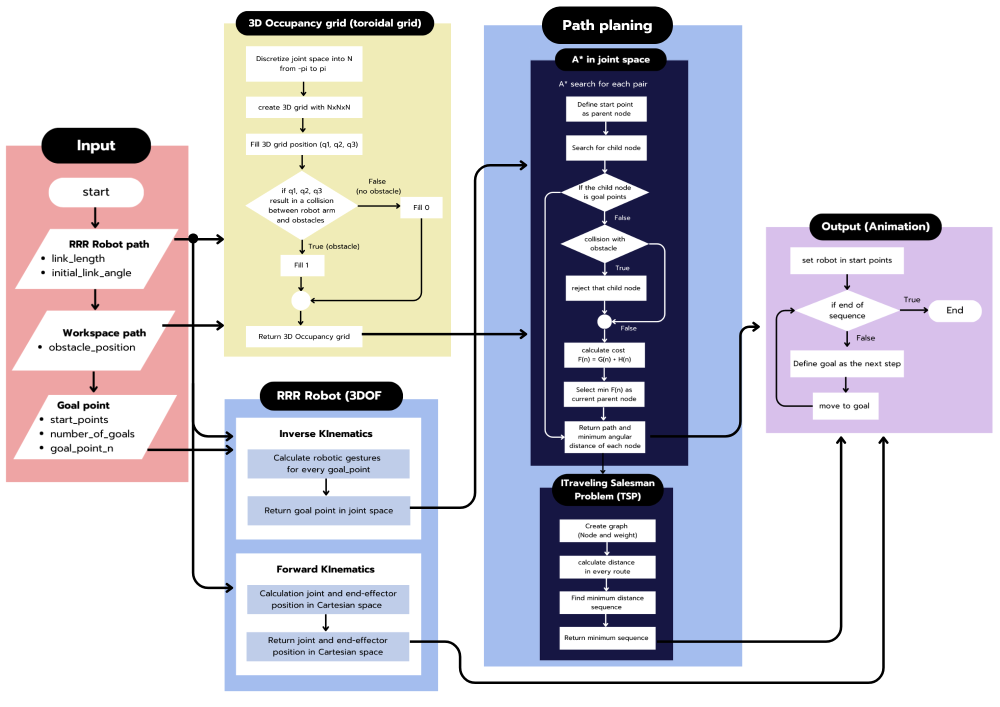
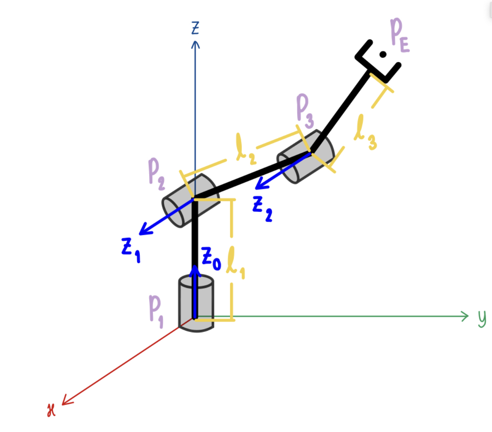
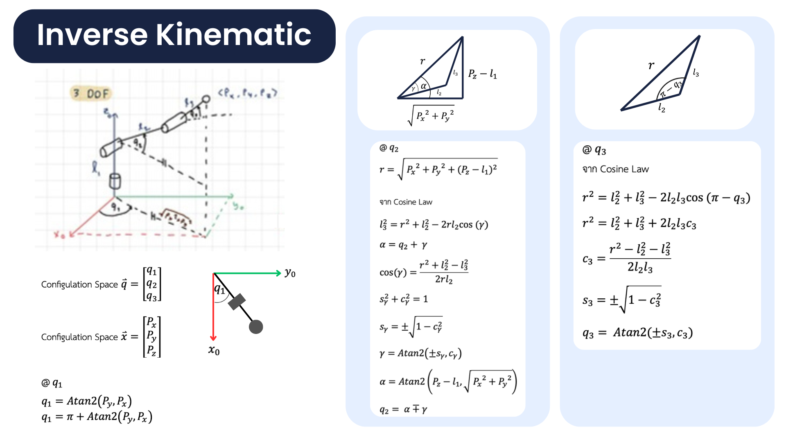
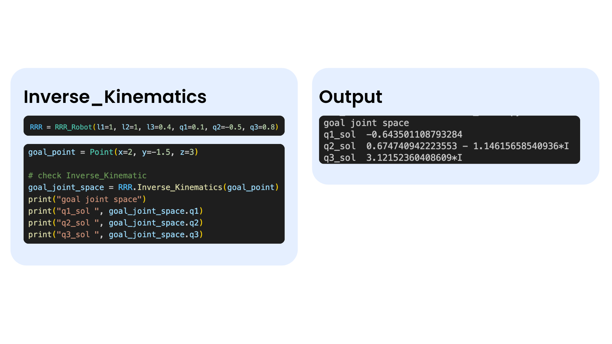
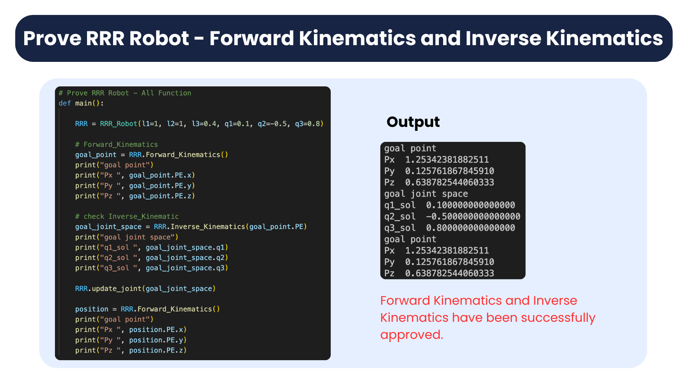
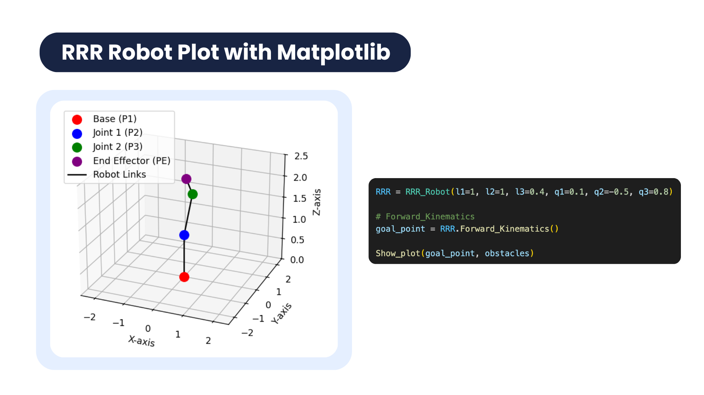

# FRA333: PATHMASTER KINEMATIC PROJECT

## จุดประสงค์โครงการ
1. เพื่อศึกษาการควบคุมหุ่นยนต์ 3 DoF (RRR) ในการหลบสิ่งกีดขวางใน Work Space เพื่อประยุกต์ความรู้ด้าน Path Planning: Route Optimization ในการค้นหาเส้นทางที่สั้นที่สุด โดยมุ่งหวังให้การเคลื่อนที่มีการหมุนของข้อต่อน้อยที่สุด  
2. เพื่อลดการใช้พลังงานและเวลาในการเคลื่อนที่ เมื่อมี Goal Points มากกว่า 1 จุด

## ขอบเขตของระบบ
1. กำหนดให้ Goal มีมากที่สุดไม่เกิน 3 Points   
2. Goal Points ที่กำหนด จะต้องเป็นจุดที่หุ่นยนต์สามารถไปถึงได้เสมอ และมีท่าทางที่เป็นไปได้ ที่ไม่ชนสิ่งกีดขวางอย่างน้อย 1 ท่าทาง	
3. สิ่งกีดขวางใน Work Space ไม่มีการเคลื่อนที่ และมีลักษณะเป็นวงกลม
4. แสดงผลในรูปแบบ Animation และโชว์ผลลัพธ์การคำนวณการหมุนของข้อต่อให้น้อยที่สุดในเชิงมุม
5. ระบบควบคุมหุ่นยนต์เพียง 3 DoF (RRR Robot) เท่านั้น
6. ค่า Input Parameter ที่สามารถกำหนดค่าเริ่มต้น และเปลี่ยนแปลงได้ ได้แก่ 
   - ความยาวของ link หุ่นยนต์ 
   - มุมเริ่มต้นของ link หุ่นยนต์
   - จำนวนและตำแหน่ง Goal Point แต่ละจุดที่ต้องการให้หุ่นยนต์เคลื่อนที่ตามเป้าหมาย
   - ขนาดและตำแหน่งของสิ่งกีดขวาง
7. ใช้ Matplotlib Library ในการทำ Simulation

## Input ของระบบ
**3D Robot Path**
- ค่าความยาว link (link_length) และตำแหน่งเริ่มต้นของหุ่นยนต์ (initial_link_angle)
  
**Work Space Path**
- ตำแหน่งและขนาดของสิ่งกีดขวางบน Workspace 3 มิติ (obstacle)
  
**Goal point Path**
- ตำแหน่งเริ่มต้น(start_points)
- จำนวน Goal points ที่ต้องการให้หุ่นยนต์เคลื่อนที่ไป(number_of_goals) ไม่เกิน 3 Point
- ตำแหน่งของแต่ละ Goal point (goal_point_1, goal_point_2, goal_point_3) ใน Cartesian space

## เป้าหมาย
- แสดงลำดับการเคลื่อนที่ของหุ่นยนต์จากตำแหน่ง Start ถึง Goal points ทั้งหมด โดยหมุนข้อต่อเชิงมุมให้น้อยที่สุด

  และสามารถหลบสิ่งกีดขวางใน Work Space ได้ 

---

## System Diagram

### RRR Robot
**Design**

**Class RRR Robot**

- **Init**
  - Input : link length (l1, l2, l3), init_link_angle (q1, q2, q3)
  - Output : None

- **Inverse Kinematic**
  - Input : goal_point (Px, Py, Pz)
  - Output : goal_joint_space (q1, q2, q3)

- **Forward Kinematic**
  - Input : joint_angle (q1, q2, q3)
  - Output : joint_pos_plot (P1, P2, P3, PE)

### RRR Robot - Forward Kinematic

### RRR Robot - Inverse Kinematic

---

## Prove RRR Robot - Forward Kinematics and Inverse Kinematics
**Prove ความถูกต้องของสมการ Forward Kinematic และ Inverse Kinematic ด้วยวิธีการดังนี้**
1. หา goal point ด้วยฟังก์ชัน Forward Kinematic
2. จากนั้นนำ Goal point ที่ได้ไปเข้าฟังก์ชัน Inverse Kinematic เพื่อให้ได้ Goal point ใน Joint space 
3. นำ Goal point ใน Joint space ไปเข้าฟังก์ชัน Forward Kinematic อีกครั้งเพื่อตรวจสอบความถูกต้อง โดยเปรียบเทียบกับ Goal point ที่หาได้ในขั้นตอนที่ 1

### RRR Robot - Function Plot
- สามารถกำหนดความยาวของแขนและตำแหน่งเชิงมุมของแต่ละ link ได้ 

### Obstacle 
**Function Create Obstacle**
- กำหนดให้สิ่งกีดขวางอยู่ในรูปแบบของทรงกลม(Sphere)
- สามารถกำหนดจำนวนสิ่งกีดขวาง ระบุขนาดกว้าง(X-axis) ยาว(Y-axis) สูง(Z-axis) และรัศมีของสิ่งกีดขวางได้  

**Function Detect Obstacle**

1.ตรวจจับการชนของข้อต่อ(joints)
  - คำนวณระยะทาง 𝑑
    โดยวัดระยะทางระหว่างพิกัดศูยน์กลางของสิ่งกีดขวางกับพิกัดของข้อต่อหุ่นยนต์ในระบบสามมิติ 
  - ตรวจสอบการชน
    หากระยะทาง 𝑑 มีค่าน้อยกว่ารัศมีของสิ่งกีดขวาง (d<=รัศมี) แสดงว่า **ข้อต่อชนกับสิ่งกีดขวาง**

2.ตรวจจับการของของแขน(links)
  - คำนวณระยะทาง 𝑑
    หาระยะทางระหว่างจุดของสิ่งกีดขวางกับ Projection เวกเตอร์ของแขนหุ่นยนต์  
  - ตรวจสอบการชน
    หากระยะทาง 𝑑 มีค่าน้อยกว่ารัศมีของสิ่งกีดขวาง (d<=รัศมี) แสดงว่า **แขนหุ่นยนต์ชนกับสิ่งกีดขวาง**
    
  

**ผลลัพธ์การตรวจจับ**

1. No Collision Detected (ตรวจพบว่าไม่ชนสิ่งกีดขวาง)

2.Collision Detected (Joint)
- ตรวจจับการชนสิ่งกีดขวางของข้อต่อหุ่นยนต์ ในกรณีพบว่า ข้อต่อชนสิ่งกีดขวาง function จะระบุ Joint Position กับ obstacle position ที่เกิดการชนกัน

3.Collision Detected (link)
- ตรวจจับการชนสิ่งกีดขวางของแขนหุ่นยนต์ ในกรณีพบว่า แขนกลชนสิ่งกีดขวาง function จะระบุ Joint Position กับ obstacle position ที่เกิดการชนกัน

### 3D Occupancy Grid (Toroidal Grid)
ทำการสร้าง 3D Occupancy Grid ซึ่งเป็น Grid ใน 3 มิติ ขนาด NxNxN โดยที่ N คือแทนขนาดของมุมใน Joint space เทียบเท่าค่า -pi ถึง pi และค่าในแต่ละช่องของ Grid แทนสถานะการชน (1) หรือไม่ชนสิ่งกีดขวาง (0) เมื่อกำหนดค่าตำแหน่งเชิงมุมของทั้ง 3 joint (q1, q2, q3) โดยมีขั้นตอนการสร้าง 3D Occupancy Grid คือ
- กำหนด N แทนขนาดของมุมใน Joint space เทียบเท่าค่า -pi ถึง pi
- สร้าง 3D Occupancy Grid ขนาด NxNxN
- วนลูปใน Grid เพื่อทำการ Fill ค่า โดยทำการเช็คว่าเมื่อค่าตำแหน่งเชิงมุมของทั้ง 3 joint (q1, q2, q3) เป็นค่าต่างๆ ทุกส่วนของ	หุ่นยนต์ชนสิ่งกีดขวางหรือไม่ ถ้าไม่ทำการ Fill 0 ลง Grid ช่องนั้นๆ แต่ถ้าชนสิ่งกีดขวาง ทำการ Fill 1 ลง Grid ช่องนั้นๆ โปรแกรมจะ	ทำงานวนลูปไปเรื่อยๆ จนกระทั่ง Fill ค่าครบทุกช่องของ Grid
- Return 3D Occupancy Grid

  
