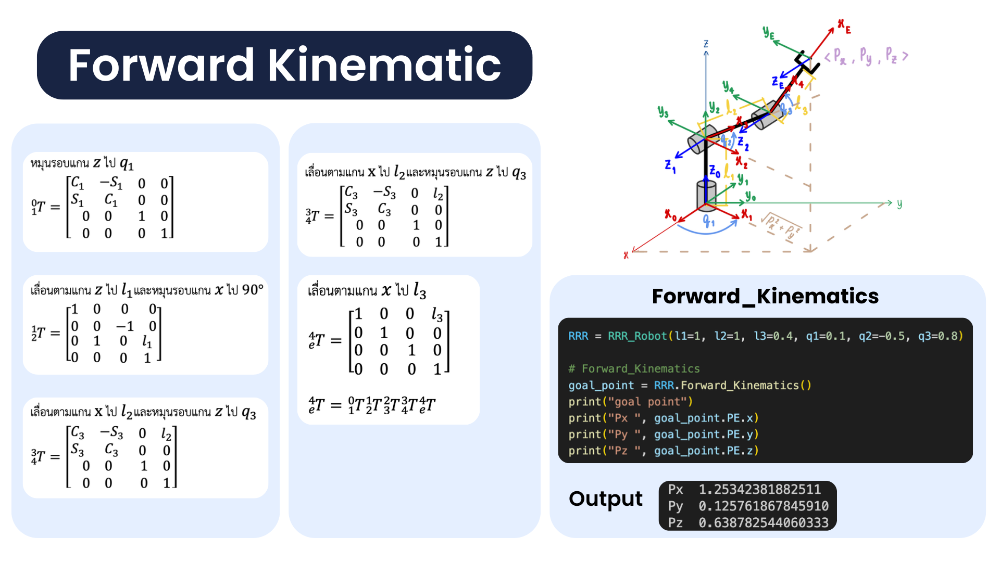

# PATHMASTER PROJECT

## จุดประสงค์โครงการ
1. เพื่อศึกษาการควบคุมหุ่นยนต์ 3 DoF (RRR) ในการหลบสิ่งกีดขวางใน Work Space เพื่อประยุกต์ความรู้ด้าน Path Planning: Route Optimization ในการค้นหาเส้นทางที่สั้นที่สุด โดยมุ่งหวังให้การเคลื่อนที่มีการหมุนของข้อต่อน้อยที่สุด  
2. เพื่อลดการใช้พลังงานและเวลาในการเคลื่อนที่ เมื่อมี Goal Points มากกว่า 1 จุด

## ขอบเขตของระบบ

## Input ของระบบ
- Goals Points 1-3 ตำแหน่ง ที่จะต้องเคลื่อน End-effector ไป
- ความยาวของแขนหุ่นยนต์และตำแหน่งเชิงมุมของหุ่นยนต์แต่ละข้อต่อ
- ขนาดและตำแหน่งของสิ่งกีดขวาง

## เป้าหมาย
- แสดงลำดับการเคลื่อนที่ของหุ่นยนต์จากตำแหน่ง Start ถึง Goal points ทั้งหมด โดยหมุนข้อต่อเชิงมุมให้น้อยที่สุด

  และสามารถหลบสิ่งกีดขวางใน Work Space ได้ 

---

## System Diagram

### RRR Robot
**Design**

**Class RRR Robot**

- **Init**
  - Input : link length (l1, l2, l3), init_link_angle (q1, q2, q3)
  - Output : None

- **Inverse Kinematic**
  - Input : goal_point (Px, Py, Pz)
  - Output : goal_joint_space (q1, q2, q3)

- **Forward Kinematic**
  - Input : joint_angle (q1, q2, q3)
  - Output : joint_pos_plot (P1, P2, P3, PE)

### RRR Robot - Forward Kinematic

### RRR Robot - Inverse Kinematic

---

## Prove RRR Robot - Forward Kinematics and Inverse Kinematics
**Prove ความถูกต้องของสมการ Forward Kinematic และ Inverse Kinematic ด้วยวิธีการดังนี้:**
1. หา goal point ด้วยฟังก์ชัน Forward Kinematic
2. จากนั้นนำ Goal point ที่ได้ไปเข้าฟังก์ชัน Inverse Kinematic เพื่อให้ได้ Goal point ใน Joint space 
3. นำ Goal point ใน Joint space ไปเข้าฟังก์ชัน Forward Kinematic อีกครั้งเพื่อตรวจสอบความถูกต้อง โดยเปรียบเทียบกับ Goal point ที่หาได้ในขั้นตอนที่ 1

### RRR Robot - Function Plot
- สามารถกำหนดความยาวของแขนและตำแหน่งเชิงมุมของแต่ละ link ได้ 

### Obstacle 
**Function Create Obstacle**
- กำหนดให้สิ่งกีดขวางอยู่ในรูปแบบของทรงกลม(Sphere)
- สามารถกำหนดจำนวนสิ่งกีดขวาง ระบุขนาดกว้าง(X-axis) ยาว(Y-axis) สูง(Z-axis) และรัศมีของสิ่งกีดขวางได้  

**Function Detect Obstacle**

1.ตรวจจับการชนของข้อต่อ(joints)
  - คำนวณระยะทาง 𝑑
    โดยวัดระยะทางระหว่างพิกัดศูยน์กลางของสิ่งกีดขวางกับพิกัดของข้อต่อหุ่นยนต์ในระบบสามมิติ 
  - ตรวจสอบการชน
    หากระยะทาง 𝑑 มีค่าน้อยกว่ารัศมีของสิ่งกีดขวาง (d<=รัศมี) แสดงว่า **ข้อต่อชนกับสิ่งกีดขวาง**

2.ตรวจจับการของของแขน(links)
  - คำนวณระยะทาง 𝑑
    หาระยะทางระหว่างจุดของสิ่งกีดขวางกับ Projection เวกเตอร์ของแขนหุ่นยนต์  
  - ตรวจสอบการชน
    หากระยะทาง 𝑑 มีค่าน้อยกว่ารัศมีของสิ่งกีดขวาง (d<=รัศมี) แสดงว่า **แขนหุ่นยนต์ชนกับสิ่งกีดขวาง**
    
  

ผลลัพธ์การตรวจจับ 

1. No Collision Detected (ตรวจพบว่าไม่ชนสิ่งกีดขวาง)

2.Collision Detected (Joint)
- ตรวจจับการชนสิ่งกีดขวางของข้อต่อหุ่นยนต์ ในกรณีพบว่า ข้อต่อชนสิ่งกีดขวาง function จะระบุ Joint Position กับ obstacle position ที่เกิดการชนกัน

3.Collision Detected (link)
- ตรวจจับการชนสิ่งกีดขวางของแขนหุ่นยนต์ ในกรณีพบว่า แขนกลชนสิ่งกีดขวาง function จะระบุ Joint Position กับ obstacle position ที่เกิดการชนกัน

